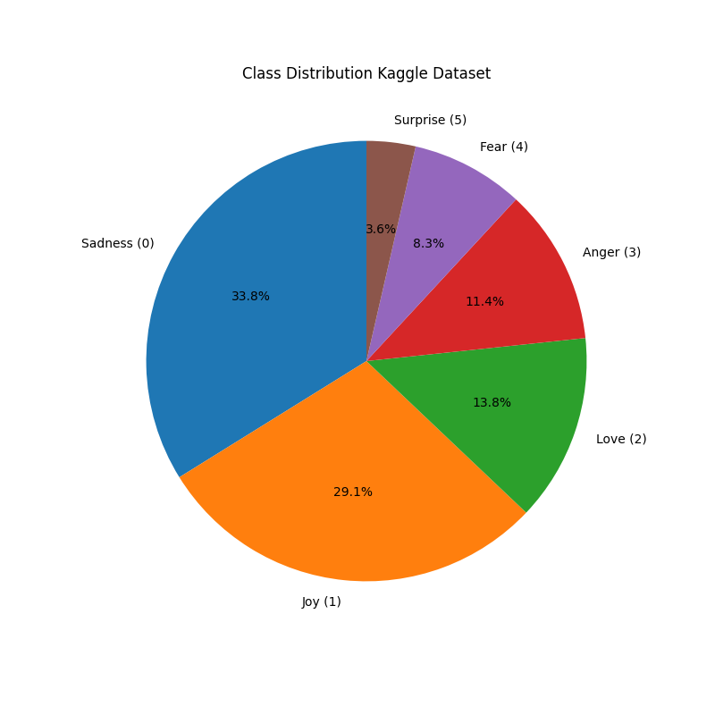

# Evaluation of Emotion Classification Models: Synthetic vs Real Data

## Objective

The goal of this experiment was to evaluate the performance of various models trained on synthetic data and Kaggle datasets to classify emotions. The findings clearly demonstrate that synthetic data generated using ChatGPT is significantly less effective in training accurate emotion classification models compared to real data. Furthermore, models trained on Kaggle data were trained on a reduced sample of 5,000 entries, equally distributed across classes, which provides a fair comparison and highlights the limitations of synthetic data.

---

## Results Summary

Synthetic_model.py

### 1. **Models Trained with Synthetic Data and Tested on second Synthetic Data**

#### **Model with BoW**
Accuracy: 0.1704
              precision    recall  f1-score   support

           0       0.17      0.84      0.28       830
           1       0.17      0.08      0.11       834
           2       0.20      0.04      0.06       835
           3       0.18      0.03      0.05       832
           4       0.20      0.02      0.04       832
           5       0.14      0.01      0.03       837

    accuracy                           0.17      5000
   macro avg       0.18      0.17      0.09      5000
weighted avg       0.18      0.17      0.09      5000

- **Observation**: Class 0 dominates the results with the highest recall (0.84), while other classes show very low recall and precision. This suggests the model heavily biases predictions toward class 0.

#### **Model with TF-IDF**
Accuracy: 0.171
              precision    recall  f1-score   support

           0       0.17      0.78      0.28       830
           1       0.17      0.08      0.11       834
           2       0.19      0.06      0.09       835
           3       0.16      0.04      0.07       832
           4       0.18      0.05      0.08       832
           5       0.15      0.02      0.04       837

    accuracy                           0.17      5000
   macro avg       0.17      0.17      0.11      5000
weighted avg       0.17      0.17      0.11      5000

- **Observation**: Similar to BoW, class 0 achieves high recall (0.78), while other classes remain poorly predicted, highlighting the lack of generalization in synthetic data.

#### **LSA with TF-IDF**
Accuracy: 0.171
              precision    recall  f1-score   support

           0       0.17      0.78      0.28       830
           1       0.17      0.08      0.11       834
           2       0.19      0.06      0.09       835
           3       0.16      0.04      0.07       832
           4       0.18      0.05      0.08       832
           5       0.15      0.02      0.04       837

    accuracy                           0.17      5000
   macro avg       0.17      0.17      0.11      5000
weighted avg       0.17      0.17      0.11      5000

- **Observation**: The performance mirrors the TF-IDF model, with class 0 receiving higher recall at the cost of other classes. This indicates that dimensionality reduction via LSA did not improve predictions.

#### **LSA with BoW**
Accuracy: 0.1704
              precision    recall  f1-score   support

           0       0.17      0.84      0.28       830
           1       0.17      0.08      0.11       834
           2       0.20      0.04      0.06       835
           3       0.18      0.03      0.05       832
           4       0.20      0.02      0.04       832
           5       0.14      0.01      0.03       837

    accuracy                           0.17      5000
   macro avg       0.18      0.17      0.09      5000
weighted avg       0.18      0.17      0.09      5000

- **Observation**: Results are nearly identical to BoW, where the model overly focuses on class 0, showing poor balance across classes.

#### **LDA with BoW**
Accuracy: 0.1632
              precision    recall  f1-score   support

           0       0.17      0.29      0.21       830
           1       0.18      0.06      0.10       834
           2       0.17      0.12      0.14       835
           3       0.16      0.34      0.21       832
           4       0.17      0.08      0.11       832
           5       0.15      0.09      0.11       837

    accuracy                           0.16      5000
   macro avg       0.17      0.16      0.15      5000
weighted avg       0.17      0.16      0.15      5000

- **Observation**: Unlike the previous methods, LDA shows slightly improved balance across classes but with lower overall accuracy. This result demonstrates LDA's difficulty in capturing meaningful patterns from synthetic data.

---

### 2. **Models Trained with Synthetic Data and Tested on Kaggle Dataset**

#### **Model with BoW**
Accuracy: 0.30347473303119654
              precision    recall  f1-score   support

           0       0.30      0.86      0.45    121187
           1       0.46      0.10      0.17    141067
           2       0.16      0.06      0.09     34554
           3       0.25      0.06      0.09     57317
           4       0.28      0.05      0.08     47712
           5       0.03      0.02      0.02     14972

    accuracy                           0.30    416809
   macro avg       0.25      0.19      0.15    416809
weighted avg       0.33      0.30      0.22    416809

- **Observation**: Class 0 dominates predictions with high recall (0.86). Other classes, particularly class 1, achieve minimal recall, showing the model's bias and failure to generalize to real data.

#### **Model with TF-IDF**
Accuracy: 0.29629878433527107
              precision    recall  f1-score   support

           0       0.31      0.79      0.44    121187
           1       0.48      0.11      0.17    141067
           2       0.13      0.07      0.09     34554
           3       0.27      0.09      0.14     57317
           4       0.20      0.08      0.11     47712
           5       0.07      0.06      0.07     14972

    accuracy                           0.30    416809
   macro avg       0.24      0.20      0.17    416809
weighted avg       0.32      0.30      0.23    416809

- **Observation**: Performance is very similar to BoW. Class 0 still dominates predictions, while recall and precision for other classes remain low

#### **LSA with TF-IDF**
Accuracy: 0.29629878433527107
              precision    recall  f1-score   support

           0       0.31      0.79      0.44    121187
           1       0.48      0.11      0.17    141067
           2       0.13      0.07      0.09     34554
           3       0.27      0.09      0.14     57317
           4       0.20      0.08      0.11     47712
           5       0.07      0.06      0.07     14972

    accuracy                           0.30    416809
   macro avg       0.24      0.20      0.17    416809
weighted avg       0.32      0.30      0.23    416809

- **Observation**: LSA does not improve performance, as the model continues to favor class 0. This emphasizes the weak representation of emotional patterns in synthetic data.

#### **LSA with BoW**
Accuracy: 0.30347473303119654
              precision    recall  f1-score   support

           0       0.30      0.86      0.45    121187
           1       0.46      0.10      0.17    141067
           2       0.16      0.06      0.09     34554
           3       0.25      0.06      0.09     57317
           4       0.28      0.05      0.08     47712
           5       0.03      0.02      0.02     14972

    accuracy                           0.30    416809
   macro avg       0.25      0.19      0.15    416809
weighted avg       0.33      0.30      0.22    416809

- **Observation**: Similar to the other models, accuracy is primarily driven by class 0's recall, highlighting the model's inability to generalize effectively.

#### **LDA with BoW**
Accuracy: 0.19539645257180147
              precision    recall  f1-score   support

           0       0.30      0.31      0.31    121187
           1       0.42      0.07      0.11    141067
           2       0.09      0.13      0.11     34554
           3       0.15      0.45      0.23     57317
           4       0.11      0.05      0.07     47712
           5       0.04      0.08      0.06     14972

    accuracy                           0.20    416809
   macro avg       0.19      0.18      0.15    416809
weighted avg       0.27      0.20      0.18    416809

- **Observation**: LDA demonstrates the poorest performance, although class 3 achieves better recall. Overall, the model fails to adapt to real-world data.

---

combine_dataset.py

### 3. **Models Trained with Combined Synthetic Datasets and Tested on Kaggle Dataset**

#### **Model with BoW**
Accuracy: 0.2932902120635591
              precision    recall  f1-score   support

           0       0.31      0.65      0.42    121187
           1       0.43      0.18      0.26    141067
           2       0.13      0.07      0.09     34554
           3       0.22      0.15      0.18     57317
           4       0.17      0.13      0.14     47712
           5       0.12      0.08      0.09     14972

    accuracy                           0.29    416809
   macro avg       0.23      0.21      0.20    416809
weighted avg       0.30      0.29      0.26    416809

- **Observation**: The model shows slightly more balanced performance across classes, but accuracy remains low overall. Class 0 continues to dominate, showing the model's bias.

#### **Model with TF-IDF**
Accuracy: 0.27671187522342366
              precision    recall  f1-score   support

           0       0.31      0.57      0.40    121187
           1       0.45      0.16      0.23    141067
           2       0.12      0.08      0.10     34554
           3       0.23      0.18      0.20     57317
           4       0.14      0.19      0.16     47712
           5       0.15      0.16      0.15     14972

    accuracy                           0.28    416809
   macro avg       0.23      0.22      0.21    416809
weighted avg       0.31      0.28      0.26    416809

- **Observation**: Similar to BoW, the TF-IDF model achieves marginal performance gains across classes. However, overall accuracy and balance remain poor.

---

Kagel_model.py

### 4. **Models Trained with Kaggle Dataset and Tested on Synthetic Dataset**

#### **Model with BoW**
Accuracy: 0.3196
              precision    recall  f1-score   support

           0       0.27      0.30      0.28       831
           1       0.50      0.30      0.38       830
           2       0.00      0.00      0.00       841
           3       0.25      0.90      0.39       839
           4       1.00      0.31      0.47       830
           5       0.52      0.10      0.17       829

    accuracy                           0.32      5000
   macro avg       0.42      0.32      0.28      5000
weighted avg       0.42      0.32      0.28      5000

- **Observation**: The model achieves improved accuracy compared to synthetic-trained models, indicating that real data is more informative. However, predictions still suffer from class imbalance, as class 3 achieves very high recall but fails to generalize to class 2, which receives no predictions. 

#### **Model with TF-IDF**
Accuracy: 0.3976
              precision    recall  f1-score   support

           0       0.12      0.19      0.15       831
           1       0.31      0.51      0.39       830
           2       0.57      0.40      0.47       841
           3       0.39      0.39      0.39       839
           4       0.80      0.80      0.80       830
           5       0.52      0.10      0.17       829

    accuracy                           0.40      5000
   macro avg       0.45      0.40      0.39      5000
weighted avg       0.45      0.40      0.40      5000

- **Observation**: This model demonstrates improved generalization compared to BoW, with better recall and precision across several classes, particularly class 4 (0.80).

#### **LSA with TF-IDF**
Accuracy: 0.4296
              precision    recall  f1-score   support

           0       0.26      0.28      0.27       831
           1       0.33      0.51      0.40       830
           2       0.56      0.50      0.53       841
           3       0.39      0.39      0.39       839
           4       0.66      0.80      0.72       830
           5       0.33      0.10      0.16       829

    accuracy                           0.43      5000
   macro avg       0.42      0.43      0.41      5000
weighted avg       0.42      0.43      0.41      5000

- **Observation**: LSA improves performance slightly compared to TF-IDF, achieving a more balanced performance across multiple classes, particularly classes 2, 3, and 4.

#### **LSA with BoW**
Accuracy: 0.3632
              precision    recall  f1-score   support

           0       0.32      0.48      0.39       831
           1       0.35      0.40      0.38       830
           2       0.00      0.00      0.00       841
           3       0.27      0.69      0.39       839
           4       1.00      0.50      0.67       830
           5       0.52      0.10      0.17       829

    accuracy                           0.36      5000
   macro avg       0.41      0.36      0.33      5000
weighted avg       0.41      0.36      0.33      5000

- **Observation**: The model performs reasonably well but fails to generalize to class 2, which receives no predictions. Class 4 achieves higher precision asbefore with BoW.

#### **LDA with BoW**
Accuracy: 0.1188
              precision    recall  f1-score   support

           0       0.11      0.11      0.11       831
           1       0.06      0.09      0.08       830
           2       0.11      0.10      0.11       841
           3       0.20      0.31      0.25       839
           4       0.00      0.00      0.00       830
           5       0.25      0.10      0.14       829

    accuracy                           0.12      5000
   macro avg       0.12      0.12      0.11      5000
weighted avg       0.12      0.12      0.11      5000

- **Observation**: This model shows the weakest performance, with low precision and recall across all classes, highlighting LDA's poor performance on synthetic data.

### 5. **Models Trained on Kaggle Subset (5,000 Entries) and Tested on Kaggle Dataset**

#### **Model with TF-IDF**
Accuracy: 0.8381053444419891
              precision    recall  f1-score   support

           0       0.89      0.84      0.87    120354
           1       0.89      0.82      0.85    140234
           2       0.67      0.91      0.77     33721
           3       0.85      0.85      0.85     56484
           4       0.83      0.80      0.81     46879
           5       0.63      0.94      0.75     14139

    accuracy                           0.84    411811
   macro avg       0.79      0.86      0.82    411811
weighted avg       0.85      0.84      0.84    411811

### 5. **Models Trained on Kaggle Subset (5,000 Entries) + 5000 Entries Syntethic and Tested on Kaggle Dataset**

#### **Model with TF-IDF**
Accuracy: 0.8373550002306883
              precision    recall  f1-score   support

           0       0.89      0.84      0.86    120354
           1       0.89      0.82      0.85    140234
           2       0.67      0.89      0.77     33721
           3       0.84      0.85      0.85     56484
           4       0.83      0.80      0.81     46879
           5       0.63      0.94      0.75     14139

    accuracy                           0.84    411811
   macro avg       0.79      0.86      0.82    411811
weighted avg       0.85      0.84      0.84    411811

- **Observation**: The results clearly demonstrate that adding 5000 synthetic data points to the 5000 Kaggle training entries does not lead to any improvement in model performance. The accuracy remains virtually unchanged (0.8381 vs. 0.8373), and the precision, recall, and F1-scores across all classes show no significant differences. This indicates that the synthetic data generated is not beneficial for enhancing the model's ability to generalize or improve its performance.

---

Kagel_model2.py

### 5. **Models Trained on Kaggle dataset train/tst split and Tested on Kaggle Dataset**

#### **Model with BoW(Kaggle train/test split, test_size=0.95)**
Accuracy: 0.885240395380826
              precision    recall  f1-score   support

           0       0.94      0.94      0.94     18178
           1       0.91      0.91      0.91     21160
           2       0.75      0.75      0.75      5183
           3       0.89      0.89      0.89      8598
           4       0.83      0.83      0.83      7157
           5       0.69      0.70      0.69      2246

    accuracy                           0.89     62522
   macro avg       0.83      0.83      0.83     62522
weighted avg       0.89      0.89      0.89     62522

- **Observation**: **BoW Model** showed comparable accuracy (**0.8852**) but slightly lower performance for classes 2 and 5.

#### **Model with TF-IDF(Kaggle train/test split, test_size=0.15)**
Accuracy: 0.8925978055724385
              precision    recall  f1-score   support

           0       0.93      0.94      0.94     18178
           1       0.91      0.93      0.92     21160
           2       0.79      0.75      0.77      5183
           3       0.89      0.89      0.89      8598
           4       0.84      0.83      0.84      7157
           5       0.74      0.70      0.72      2246

    accuracy                           0.89     62522
   macro avg       0.85      0.84      0.85     62522
weighted avg       0.89      0.89      0.89     62522

- **Observation**: **TF-IDF Model** achieved the highest accuracy (**0.8926**) among all tested models with strong performance across major classes

#### **LSA with TF-IDF (Kaggle train/test split, test_size=0.1, n_topics = 400)**
Accuracy: 0.8091936373887383
              precision    recall  f1-score   support

           0       0.86      0.86      0.86     12119
           1       0.76      0.90      0.83     14107
           2       0.76      0.54      0.63      3455
           3       0.86      0.76      0.80      5732
           4       0.82      0.72      0.77      4771
           5       0.77      0.67      0.71      1497

    accuracy                           0.81     41681
   macro avg       0.81      0.74      0.77     41681
weighted avg       0.81      0.81      0.81     41681

- **Observation**: **LSA with TF-IDF** suffered a significant drop in accuracy (**0.8092**), particularly affecting recall for minority classes. (Dimensionality reduction via **LSA** can reduce overall performance, especially in imbalanced datasets.)

---

TrainedFullKaggle_TestedSynthetic.py

### 5. **Models Trained on complete Kaggle dataset and tested on Synthetic dataset**

#### **Model with TF-IDF**
Accuracy: 0.4308
              precision    recall  f1-score   support

           0       0.38      0.49      0.43       831
           1       0.27      0.80      0.40       830
           2       0.00      0.00      0.00       841
           3       0.80      0.39      0.53       839
           4       0.89      0.80      0.84       830
           5       0.52      0.10      0.17       829

    accuracy                           0.43      5000
   macro avg       0.47      0.43      0.39      5000
weighted avg       0.47      0.43      0.39      5000

#### **Model with BoW**
Accuracy: 0.3328
              precision    recall  f1-score   support

           0       0.35      0.39      0.37       831
           1       0.22      0.80      0.34       830
           2       0.00      0.00      0.00       841
           3       0.50      0.20      0.29       839
           4       1.00      0.51      0.68       830
           5       0.52      0.10      0.17       829

    accuracy                           0.33      5000
   macro avg       0.43      0.33      0.31      5000
weighted avg       0.43      0.33      0.31      5000

#### **LSA with TF-IDF**
Accuracy: 0.4828
              precision    recall  f1-score   support

           0       0.41      0.49      0.45       831
           1       0.31      0.71      0.43       830
           2       0.75      0.30      0.43       841
           3       0.54      0.70      0.61       839
           4       1.00      0.60      0.75       830
           5       0.52      0.10      0.17       829

    accuracy                           0.48      5000
   macro avg       0.59      0.48      0.47      5000
weighted avg       0.59      0.48      0.47      5000

- **Observation**: LSA combined with TF-IDF achieves the highest accuracy at 48.28%, suggesting that dimensionality reduction slightly improves generalization to synthetic data. However, the performance remains inconsistent across classes.

#### **LSA with BoW**
Accuracy: 0.4132
              precision    recall  f1-score   support

           0       0.32      0.49      0.39       831
           1       0.24      0.71      0.36       830
           2       0.00      0.00      0.00       841
           3       0.80      0.39      0.52       839
           4       1.00      0.80      0.89       830
           5       0.52      0.10      0.17       829

    accuracy                           0.41      5000
   macro avg       0.48      0.41      0.39      5000
weighted avg       0.48      0.41      0.39      5000

- **Observation**: These results highlight that models trained on real-world Kaggle data struggle to generalize to synthetic data, as evidenced by the significantly lower accuracy and uneven class performance. This underscores the lack of alignment between the real and synthetic datasets, further demonstrating the limitations of synthetic data in effectively representing emotional patterns for model training.
_______________________

## Summary

1. **Synthetic Data vs. Real Data**:
        Models trained on synthetic data (ChatGPT-generated) perform poorly, with accuracy around 17%-30%. These models heavily bias predictions toward dominant classes (e.g., class 0).
        In contrast, models trained on Kaggle data with a train-test split of 0.15 achieve accuracies of 88.5% (BoW) and 89.3% (TF-IDF).

2. **Performance on Real Data**:
        BoW and TF-IDF models trained on Kaggle data perform remarkably well, achieving balanced precision and recall across all classes. Even smaller classes like class 5 reach reasonable performance.

3. **Generalization Issues**:
        Models trained on synthetic data fail to generalize to real datasets, emphasizing the limitations of ChatGPT-generated data in capturing emotional nuances.

4. **Model Comparison**:
        LDA fails to provide meaningful improvements in performance when trained on synthetic data or on real data.
        LSA slightly improves performance, especially when combined with TF-IDF and trained on real data and tested on synthetic data(which is balanced).
        TF-IDF outperforms BoW when trained on real data but does not show the same advantage when trained on synthetic data.

5. **Possible Explanation for LDA's Poor Performance**:
        Class Distribution

        The uneven class distribution in the Kaggle dataset could be a significant factor contributing to the lower performance of the LDA model. A model like LDA, which relies on linear discriminant assumptions, may struggle to handle imbalanced datasets effectively.
Class Distribution

        The following diagram illustrates the class distribution in the Kaggle dataset:

        The significant discrepancy in the number of samples across classes indicates that some classes are overrepresented while others are underrepresented. This imbalance may lead to predictions skewed in favor of the overrepresented classes.

## Conclusion

The results clearly highlight the superiority of real data (Kaggle dataset) over synthetic data for emotion classification. Models trained on real data achieve nearly 90% accuracy, while those trained on synthetic data perform poorly. This confirms that ChatGPT struggles to generate high-quality, emotionally diverse datasets, further supporting the notion that ChatGPT is limited in its ability to understand or represent emotions effectively.

